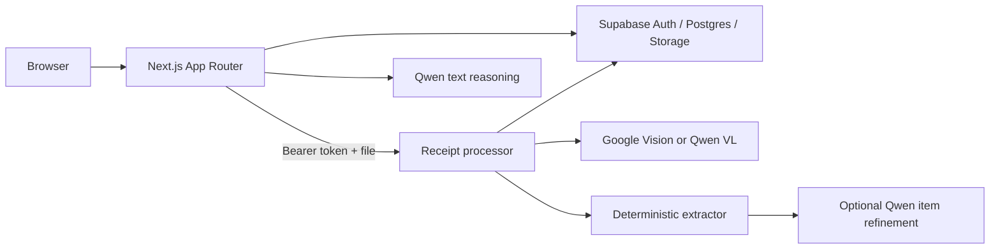
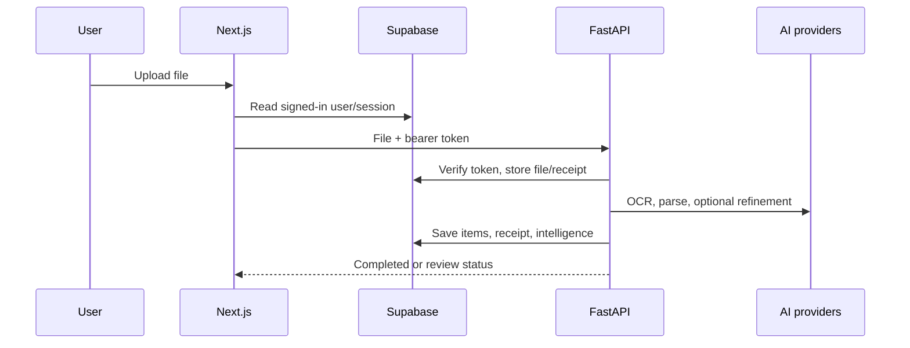

# ReceiptBrain architecture

## Folder structure

```text
app/                         Next.js pages, actions, API routes
components/                  Product/layout/UI components
lib/                         Queries, Supabase clients, local intelligence/chat
services/receipt-processor/  FastAPI OCR/extraction/persistence service
supabase/                    Schemas and migrations
tests/                       Frontend Vitest tests
docs/                        Product, fixture, and hackathon material
```

## Application layers



## Frontend

- Server components load data through `lib/dashboard.ts` and `lib/receipts.ts`.
- Client components handle upload, line-item edit, chat, and sharing.
- Supabase SSR/browser/middleware helpers maintain the user session.
- Next API routes proxy upload, serve private files, and expose chat/analytics.

## Backend

- `app/api/routes.py`: health/upload/read/reprocess HTTP endpoints.
- `app/api/deps.py`: auth, repository, storage, OCR, and refiner selection.
- `app/services/`: processing orchestration and Supabase/memory adapters.
- `app/providers/ocr.py`: mock, Google Vision, and Qwen VL.
- `app/dspy_pipeline/`: deterministic field extractors.
- `app/models/`: Pydantic contracts.

## Database

| Table | Role |
| --- | --- |
| `receipts` | Receipt metadata, OCR, amounts, state, file metadata |
| `receipt_items` | Owner-scoped extracted/reviewed line items |
| `categories` | Shared category vocabulary |
| `merchants` | Per-user normalized merchants |
| `insights` | Per-user structured insights with lifecycle status |
| `spending_patterns` | Recurring/trend records |
| `user_profiles` | DNA, streak, and preferences/achievements |

User data is RLS-protected. Source files are in private `receipts` storage.

## APIs

| Layer | Endpoint | Purpose |
| --- | --- | --- |
| Next | `POST /api/documents` | Validated authenticated upload proxy |
| Next | `GET /api/documents/[id]/file` | Private receipt preview/download |
| Next | `POST /api/ai-chat` | Qwen/fallback grounded chat |
| Next | `GET /api/analytics/trends` | Merchant/category range totals |
| Next | `GET /api/insights` | Story/DNA data contract |
| FastAPI | `GET /health` | Health/version |
| FastAPI | `POST /v1/receipts` | Create/store/process receipt |
| FastAPI | `GET /v1/receipts/{id}` | Owner-scoped receipt |
| FastAPI | `POST /v1/receipts/{id}/reprocess` | Owner-scoped reprocessing |

## Authentication and upload flow



## Important design decisions

- Completion requires exact item-total reconciliation within £0.01.
- Deterministic extraction comes before optional Qwen refinement.
- Service-role persistence is isolated to FastAPI; browser reads are user/RLS scoped.
- Memory/mock adapters keep local demos working without cloud configuration.
- Root schema files overlap timestamped migrations; migration order must be treated
  deliberately rather than assuming one SQL file is canonical.
